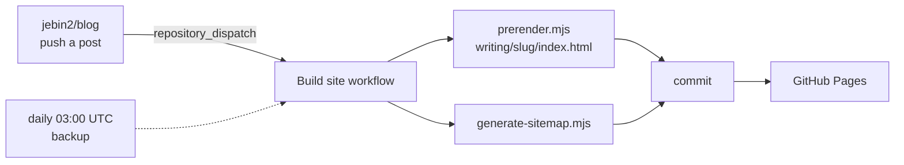

# jebin2.github.io

The website — **https://www.voidall.com**. Static, no framework, no bundler, no runtime
dependencies. Plain HTML, one stylesheet, and native ES modules.

The words live in a separate repo, [jebin2/blog](https://github.com/jebin2/blog). This repo
holds everything that displays them, plus a small build that turns each post into a real
static page.

---

## How content gets here



`.github/workflows/sitemap.yml` (“Build site”) runs on four triggers:

| Trigger | When |
|---|---|
| `repository_dispatch` | the blog repo publishes — arrives in ~2s |
| `schedule` | daily 03:00 UTC, so a missed dispatch still gets picked up |
| `workflow_dispatch` | manual run |
| `push` | `config.json`, `js/utils.js` or `scripts/**` changed |

It installs `marked`, prerenders every post, rebuilds the sitemap, and commits only if
something actually changed.

### Running the build locally

```bash
npm install --no-save marked@9.1.6
node scripts/prerender.mjs        # writes writing/<slug>/index.html
node scripts/generate-sitemap.mjs # writes sitemap.xml
```

Both read post content from the origin (`raw.githubusercontent.com`) rather than the CDN, so
a build always sees the newest Markdown. Output is deterministic — dates are formatted from
the literal date in the manifest, not the machine's timezone, so CI and a laptop produce
identical files.

---

## Layout

| Path | |
|---|---|
| `config.json` | **the one file that says where content lives** — manifest, projects, links, and the base URL for post assets |
| `index.html` | post listing (home) |
| `writing/index.html` | the writing listing |
| `writing/<slug>/` | **generated** — one prerendered page per post |
| `projects.html`, `linksilike.html`, `stats.html` | the other pages |
| `404.html` | not-found page, and the fallback renderer for posts not yet built |
| `css/style.css` | the whole stylesheet |
| `js/*.js` | one module per page, plus shared helpers |
| `scripts/*.mjs` | build scripts (Node, run in CI) |
| `sitemap.xml` | **generated** |

### The JavaScript

| Module | |
|---|---|
| `shared.js` | loads `config.json`, injects header/footer, sets per-view metadata |
| `cache.js` | sessionStorage with a 5-minute TTL; falls back to a **stale** entry when the network fails |
| `utils.js` | escaping, date parsing, the post listing, and `slugifyTitle()` |
| `blog.js` | the writing listing, and client-side post rendering (the fallback path) |
| `post.js` | runs on prerendered pages — chrome, analytics, highlighting, share UI |
| `share.js` | admin-only X share + article modal |
| `analytics.js` | fire-and-forget event inserts to Supabase |
| `supabase.js` | client config and the JSON fetch helper |

`slugifyTitle()` in `utils.js` is imported by **both the browser and the build**, so listing
links always resolve to the files the build wrote. Changing that function changes every post
URL.

---

## How a page renders

Prerendered post pages arrive with the article already in the HTML — a preview bot, a search
crawler or a reader with JS disabled all get the real post. JavaScript afterwards only adds
the nav and footer, syntax highlighting, a read count, and (for admins) the share buttons.

The listing pages are still client-rendered: they fetch `manifest.json` through jsDelivr and
two `get_stats` calls from Supabase — one for the all-time sort, one for the 24-hour counter
shown next to each title.

If a post exists in the manifest but hasn't been prerendered yet, `/writing/<slug>/` 404s,
GitHub Pages serves `404.html`, and `blog.js` resolves the slug against the manifest and
renders it in the browser. The legacy `/writing/?post=<path>` URLs still work the same way
and point their canonical at the prerendered page.

## Analytics

Writes go straight to a Supabase `events` table with a publishable key (insert-only RLS).
Reads never touch the table — they go through the `get_stats` RPC, which aggregates
server-side and takes an optional `since_date`. `js/analytics-embed.js` is a standalone
snippet for tracking clicks from other projects.

Analytics failures are swallowed by design: counting reads must never block reading.

---

## Worth knowing

**Bumping `marked` means regenerating SRI hashes.** `writing/index.html` and `404.html` load
it from a CDN with `integrity` attributes; a stale hash blocks the script and posts stop
rendering on the fallback paths. Keep the pinned version in the workflow matching the one in
the HTML so build-time and client-side rendering agree.

**Post URLs come from post titles.** Renaming a post in the blog repo moves its URL and
prunes the old directory — the old link dies with no redirect.

**`isAdmin()` is a localStorage flag**, trivially set by anyone. It only reveals share and
export UI, nothing privileged. Don't let it grow into gating anything that matters.
