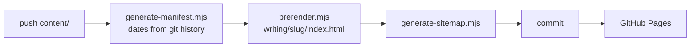

# jebin2.github.io

The site — **https://www.voidall.com**. Static, no framework, no bundler, no runtime
dependencies. Plain HTML, one stylesheet, and native ES modules.

Posts live in `content/` in this same repo, so writing and publishing are one push. Every
byte a reader receives is served by GitHub Pages; nothing is fetched from a third party at
read time.

---

## Publishing a post

Create a folder under `content/` and a `.md` file inside it with **the same name**:

```
content/C/Bitfields/Bitfields.md   ✅ indexed as a post
content/C/Bitfields/header.png     ✅ image, referenced as 
content/C/Bitfields/draft.md       ❌ silently ignored — name doesn't match the folder
```

```bash
git add . && git commit -m "post: bitfields" && git push
git pull   # the build commits back to main; pull before your next push
```

Everything else is generated: the index, the date, the URL, the page, the description, the
preview image, and the sitemap entry.

> If a post never shows up, check the filename/folder rule first — a mismatch is skipped
> silently, by design, so a post can keep notes and images in its own directory.

### Images and links inside a post

Use plain relative paths — ``. The build rewrites them to `/content/…` when
it renders the page. Absolute `https://` links are left alone.

---

## The build



`.github/workflows/sitemap.yml` (“Build site”) runs on a push touching `content/`,
`config.json`, `js/utils.js` or `scripts/**` — or manually via **Run workflow**. It commits
only when the output actually changes.

| Script | Writes | |
|---|---|---|
| `generate-manifest.mjs` | `content/manifest.json` | Indexes posts and SVGs. Dates come from each file's git history — a fast single pass over `git log`, falling back to `--follow` for files that have been renamed. |
| `prerender.mjs` | `writing/<slug>/index.html` | Renders each post's Markdown with `marked`, and writes real per-post `<title>`, description, `og:image` and canonical. |
| `generate-sitemap.mjs` | `sitemap.xml` | Static pages dated by their last commit, posts by `last_modified_date`. |

### Running it locally

```bash
npm install --no-save marked@9.1.6
node scripts/generate-manifest.mjs
node scripts/prerender.mjs
node scripts/generate-sitemap.mjs
```

The build reads everything off disk — no network — so it works offline and can't be broken
by an upstream outage. Output is deterministic: the displayed date is formatted from the
literal date in the manifest rather than the machine's timezone, so CI and a laptop produce
identical files.

---

## Layout

| Path | |
|---|---|
| `content/` | **the posts**, their images, `data/*.json`, `svgs/`, and the generated `manifest.json` |
| `config.json` | the one file that says where content lives — local paths under `/content/` |
| `index.html` | post listing (home) |
| `writing/index.html` | the writing listing |
| `writing/<slug>/` | **generated** — one prerendered page per post |
| `projects.html`, `linksilike.html`, `stats.html` | the other pages |
| `404.html` | not-found page, and the fallback renderer for posts not yet built |
| `sitemap.xml` | **generated** |
| `.nojekyll` | stops Pages filtering `content/` through Jekyll |
| `css/style.css` | the whole stylesheet |
| `js/*.js` | one module per page, plus shared helpers |
| `scripts/*.mjs` | build scripts (Node, run in CI) |

### The JavaScript

| Module | |
|---|---|
| `shared.js` | loads `config.json`, injects header/footer, sets per-view metadata |
| `cache.js` | sessionStorage with a 5-minute TTL; falls back to a **stale** entry when a fetch fails |
| `utils.js` | escaping, date parsing, the post listing, and `slugifyTitle()` |
| `blog.js` | the writing listing, client-side post rendering, and the not-found view |
| `post.js` | runs on prerendered pages — chrome, analytics, highlighting, share UI |
| `share.js` | admin-only X share + article modal |
| `analytics.js` | fire-and-forget event inserts to Supabase |
| `supabase.js` | client config and the JSON fetch helper |

`slugifyTitle()` in `utils.js` is imported by **both the browser and the build**, so listing
links always resolve to the files the build wrote. Changing that function changes every post
URL.

---

## How a page renders

Prerendered post pages arrive with the article already in the HTML — a preview bot, a search
crawler, or a reader with JS disabled all get the real post. JavaScript afterwards only adds
the nav and footer, syntax highlighting, a read count, and (for admins) the share buttons.

The listing pages are still client-rendered: they fetch `/content/manifest.json` from this
same origin plus two `get_stats` calls to Supabase — one for the all-time sort, one for the
24-hour counter beside each title.

**Fallbacks.** If a post is in the manifest but hasn't been prerendered yet, `/writing/<slug>/`
404s, Pages serves `404.html`, and `blog.js` resolves the slug against the manifest and
renders it in the browser. Legacy `/writing/?post=<path>` URLs work the same way and point
their canonical at the prerendered page. Any other unknown URL gets a real not-found.

## Analytics

Writes go straight to a Supabase `events` table with a publishable key (insert-only RLS).
Reads never touch the table — they go through the `get_stats` RPC, which aggregates
server-side and takes an optional `since_date`. `js/analytics-embed.js` is a standalone
snippet for tracking clicks from other projects.

Analytics failures are swallowed by design: counting reads must never block reading.

---

## Worth knowing

**Post dates come from git history.** Never rewrite history under `content/`, and never copy
posts in without it — a plain copy resets every `created_date` to the day of the copy. This
is why the blog repo was merged in with its full history rather than copied.

**Post URLs come from post titles.** `Pointer Arithmetic` → `/writing/pointer-arithmetic/`.
Renaming a post moves its URL and prunes the old directory, with no redirect. Rename freely
before sharing a post; think twice afterwards. Two posts can't share a title — the build
fails loudly rather than letting one page overwrite the other.

**Bumping `marked` means regenerating its SRI hash.** `writing/index.html` and `404.html`
load it from a CDN with `integrity` set; a stale hash blocks the script and the client-side
fallback stops rendering. Keep the version pinned in the workflow matching the one in the
HTML so build-time and browser rendering agree.

**`isAdmin()` is a localStorage flag**, trivially set by anyone. It only reveals share and
export UI, nothing privileged. Don't let it grow into gating anything that matters.

---

## History

Posts used to live in a separate repo, [jebin2/blog](https://github.com/jebin2/blog), fetched
at read time through the jsDelivr CDN and built via a cross-repo trigger. That repo is
**retired** — its history now lives under `content/` here. Pushing to it no longer affects
this site.
