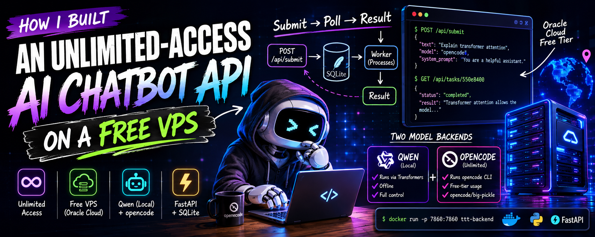

# How I Built an Unlimited-Access AI Chatbot API on a Free VPS



My other projects kept calling OpenAI and the credits kept disappearing. I didn't want to keep paying per token for something I'm running a hundred times a day testing pipelines. So I stopped and built a replacement that costs nothing.

Oracle Cloud has a free tier that gives you a permanent ARM VM — 4 OCPUs, 24 GB RAM, no expiry. That's enough to run a 4B model locally without a GPU. Or you can just run it on your own laptop, or throw it on a Hugging Face Docker Space for free. Either way, same setup.


## The idea

Wrap a model behind a simple async API. You POST a prompt, get a task ID, poll until it's done. Nothing fancy. The point is it works like any other AI API so dropping it into an existing project is trivial — swap the endpoint, done.

The backend is FastAPI with a SQLite task queue. One worker processes tasks in order. Multiple requests queue up fine.


## Two ways to generate

The interesting part is you get to choose the model per request.

`qwen` runs locally via HuggingFace Transformers. Loaded once, reused for every task. Pick the size based on your RAM — 4B works on 8 GB, 7B needs ~16 GB. Fully offline, no external calls.

`opencode` is the real unlock. opencode is an AI coding terminal with a generous free tier. The worker just shells out: `opencode run --print-logs --model opencode/big-pickle <prompt>`. If it's not installed, it auto-installs on first run. You get quality output and zero API costs. This is what I use for anything I'm running repeatedly.


## Running it

```bash
git clone https://github.com/jebin2/TTT
cd TTT/hf_backend
docker build -t ttt-backend .
docker run -p 7860:7860 ttt-backend
```

For HF Spaces: upload the `hf_backend` folder as a Docker space, port 7860, done.

Two endpoints you actually need:

`POST /api/submit` — send your prompt and model choice, get back a task ID.

`GET /api/tasks/<id>` — poll this until `status` is `completed`. Result is in the response.

Full API docs are in the repo README.


## That's it

Deploy it once, point your projects at it, never think about token limits again. I use it as the AI layer in several other things I'm building. The opencode backend in particular — free, decent quality, handles everything I've thrown at it.

Code: [github.com/jebin2/TTT](https://github.com/jebin2/TTT)
