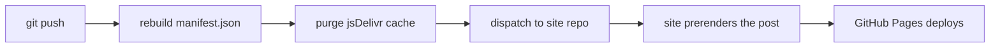

# blog

The writing. Posts live here as Markdown; the site that renders them lives in
[jebin2/jebin2.github.io](https://github.com/jebin2/jebin2.github.io) and is published at
**https://www.voidall.com**.

Nothing is copied between the two repos by hand. Pushing here triggers a chain that
rebuilds the site in about a minute.

---

## Adding a post

Create a folder named after the post, and a `.md` file inside it with **the same name**:

```
C/Bitfields/Bitfields.md          ✅ indexed as a post
C/Bitfields/header.png            ✅ image, referenced as 
C/Bitfields/notes.md              ❌ ignored — name doesn't match the folder
```

> **The filename must equal the folder name.** `manifest.json` is built by
> `.github/workflows/update-manifest.yml`, which skips any `.md` whose name doesn't match
> its parent folder. This is what lets a post keep its images in the same directory without
> them being mistaken for posts.

Also skipped: anything starting with `__`, plus `README.md`, `index.md` and `prompt.md`.

Then push:

```bash
git add . && git commit -m "post: bitfields" && git push
```

That's the whole job. Dates, the index, the URL, the page and the sitemap entry are all
generated for you.

### Links and images inside a post

Use plain relative paths — ``, `[see this](diagram.svg)`. The site rewrites
them to absolute CDN URLs when it builds the page. Absolute `https://` links are left alone.

---

## What happens when you push



All of steps B–D run in `.github/workflows/update-manifest.yml`:

| Step | What it does |
|---|---|
| **manifest** | Walks the git history and writes `manifest.json` — title, path, created and last-modified dates for every post. Dates come from your commits, so you never type one. |
| **purge** | Tells jsDelivr to drop its cached copies of `manifest.json`, `data/*.json` and any served file this push changed. Without it a new post stays invisible for up to ~12h. |
| **dispatch** | Sends a `content-updated` `repository_dispatch` to the site repo so it rebuilds now instead of waiting for its daily run. |

Both the purge and the dispatch are **best-effort** — if either fails, the workflow still
succeeds and the site's daily 03:00 UTC build catches up.

You can also run the whole thing by hand without pushing anything:

```bash
gh workflow run update-manifest.yml --repo jebin2/blog
```

---

## Files

| Path | |
|---|---|
| `AI/`, `C/`, `ml/`, `guide/` | posts, one folder each |
| `data/projects.json` | feeds the site's Projects page |
| `data/links.json` | feeds the site's Links page |
| `svgs/` | standalone SVGs, also indexed in the manifest |
| `manifest.json` | **generated** — do not edit by hand |

## Secrets

| Name | Why |
|---|---|
| `SITE_DISPATCH_TOKEN` | Lets this repo tell the site repo to rebuild. Needs **Contents: read and write** on `jebin2/jebin2.github.io`. If it is missing or expired the workflow logs a warning and skips — publishing still works, just on the daily schedule. |

---

## Worth knowing

**A post's URL comes from its title.** `Pointer Arithmetic` becomes
`/writing/pointer-arithmetic/`. Renaming the title moves the URL and the old one stops
working, with no redirect. Rename freely before sharing a post; think twice afterwards.

**Two posts can't share a title.** The site build fails loudly on a slug collision rather
than letting one page overwrite the other.
